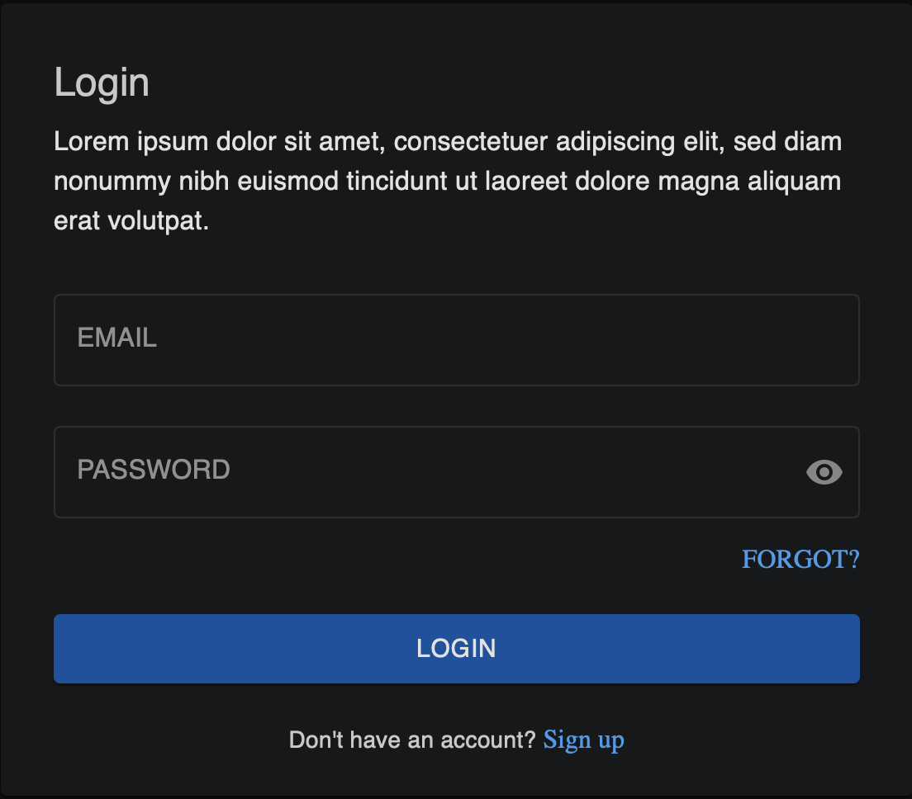

# Feature Breakdown

# Login

Enables users to signup/login with email and password, or use their AzureAd accounts to sign in.

## APIs and Endpoints

### **1) Login**

Endpoint:  `[POST] api/user/login`

Description: Email and password will be passed to the API.

### **2) Logout**:

Endpoint: `[POST] api/user/logout`

### 3) SSO Login:

Endpoint: `[POST] api/user/ssologin`

Description: The authentication token should be passed as authorisation header.

### **4) Signup**:

Endpoint: `[POST] api/user/createuser` 

## Components

1. Standard Login <= existing
2. SSO Login <= new button
3. Signup <= new page or modal

# Dashboard

Quick view of inspections together with some simple visualisations.

## Summeries

Three figures on top show a summary of structures, inspections and users.

### 1) Total Models

Rename label to <Total Structures>

Endpoint: `api/structure/list`

### 2) Total Users

Endpoint: `api/user/list`

### 3) Total Reports

Endpoint: `api/inspection/list`

### UI Components

Upon clicking on <View All> a new page with a list of figures will be apearing.

The list will be using the same component as Reports tiles below.

## Visualisation

With the same endpoints above, project the aggregated results into these charts.

## Reports

Turn the static elements into reusable components.

Clicking on both reports and upcoming tasks, a new page called <Inspection> will be opened which shows the inspection detail.

The <inspection detail page>; design will be provided.

### Upcoming Tasks

Showing only `ToDo` tasks.

Endpoint: `api/list/bystatus/{status}`

status: `["ToDo" | "In Progress" | "Completed"]`

### Reports

Showing only `Completed` tasks.

Endpoint: `api/list/bystatus/{status}`

status: `["ToDo" | "In Progress" | "Completed"]`

# Model Management

Displays a list of inspections.

Able to search and filer by status.

Create new components for the tiles.

Endpoint: `api/list/bystatus/{status}`

status: `["ToDo" | "In Progress" | "Completed"]`

Upon clicking on the arrow, it’ll be redirected to <inspection detail page> mentioned above.

# User Management

Displays list of users.

Endpoint: `api/user/list`

Upon clicking on the user list of inspections associated with the user will be appeared on the right.

**View Report**: it’ll be redirected to <inspection detail page> mentioned above.

**Reassign**: opens a modal with the list of users. Uses the same component as the User Management itself with an extra link button <Assign>.

Endpoint: `api/inspection/assign`

**Assign**: do nothing at the moment.

## Add new user

Create a modal with user’s details to be added:

- Region: request from endpoint: `api/user/list/regions` to get the list of region and load them in a dropdown. Persist the `Guid`.
- Email `<string>`
- Name `<string>`

Then call `CreateUserAsync` Endpoint: `[POST] api/user`

## User Profile

Use the same model as create user for user profile which allows user to update their detail.

Endpoint `[PUT] api/user`